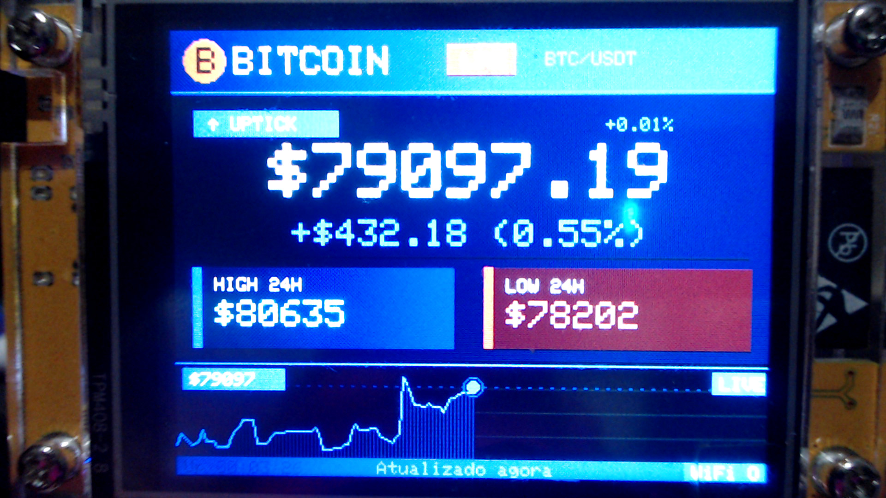

# 💰 BTC Price Monitor

### ESP32 + Display TFT (CYD)

<p align="center">
  
</p>

<p align="center">
  Monitor de preço do Bitcoin em tempo real usando ESP32 com display TFT.
</p>

---

<p align="center">
  
  
  
  
</p>

---

## 🚀 Visão Geral

Este projeto transforma um **ESP32 com display TFT** em um monitor dedicado para exibir o preço do Bitcoin em tempo real.

Ideal para:

* 📊 Monitoramento contínuo
* 🖥️ Setup de mesa
* ⚡ Projetos embarcados com crypto

---

## 🧰 Hardware Compatível

* ✅ ESP32 (recomendado: **ESP32-2432S028R - CYD**)
* ✅ Display TFT (ILI9341 ou ST7789)
* ✅ Cabo USB
* ✅ Wi-Fi 2.4GHz

---

## ⚙️ Funcionalidades

* 📡 Conexão automática ao Wi-Fi
* 💲 Consulta de preço em tempo real
* 🌐 Integração com APIs públicas
* 📺 Interface gráfica no display
* 🔄 Atualização automática

---

## 📁 Estrutura do Projeto

```bash
BTCWallet/
├── BTC_PRICE.ino        # Código principal
├── secrets.h            # Wi-Fi (NÃO subir no GitHub)
├── Imagens/
│   └── ESP32-2432S028R.jpg
│   └── ESP32-2432S028R_CYD.jpg
```

---

## 🔐 Configuração

Edite o arquivo `secrets.h`:

```cpp
#define WIFI_SSID "SEU_WIFI"
#define WIFI_PASSWORD "SUA_SENHA"
```

🔒 Adicione ao `.gitignore`:

```bash
secrets.h
```

---

## 🛠️ Instalação

### 1. Arduino IDE

https://www.arduino.cc/en/software

---

### 2. Suporte ESP32

Adicione nas preferências:

```
https://raw.githubusercontent.com/espressif/arduino-esp32/gh-pages/package_esp32_index.json
```

Instale:

```
ESP32 by Espressif Systems
```

---

### 3. Bibliotecas

Instale:

* WiFi
* HTTPClient
* ArduinoJson
* TFT_eSPI

---

### 4. Configurar Display

No arquivo `User_Setup.h`:

**ST7789**

```cpp
#define ST7789_DRIVER
```

---

### 5. NO ARDUINO IDE - Upload

* Selecione: `ESP32-2432S028R CYD`
* Clique em **Upload**

---

## 🌐 API

Exemplo:

```
https://api.binance.com/api/v3/ticker/24hr?symbol=BTCUSDT
```

---

## 🎨 Customização

Você pode alterar:

* 🎯 Moeda (USD / BRL)
* ⏱️ Intervalo de atualização
* 🎨 Cores e layout
* 🔤 Fontes

---

## ⚠️ Troubleshooting

### Tela com designer azul

* Driver correto (ST7789)

### Wi-Fi não conecta

* Apenas 2.4GHz

---

## 📈 Próximas melhorias

* [ ] Gráfico de preço
* [ ] Histórico local
* [ ] Multi-criptomoedas
* [ ] Touch interface

---

## 📜 Licença

MIT

---

## 👨‍💻 Autor

Projeto focado em ESP32 + Price Monitor.

---
